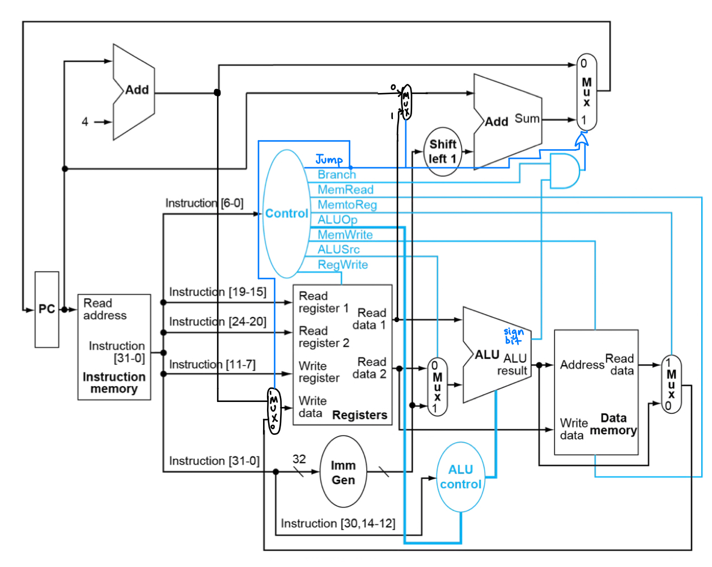

# ECE M116C Computer Assignment 1
Nick Pavlosky

## Datapath

Differences from the single-cycle datapath in class:
- To support `BLT` instead of `BEQ`, use the sign bit of the ALU result instead of Zero.
- To support `JALR`, add a Jump control signal. This controls whether the data result or `pc + 4` is stored in the registers, and whether `pc + immediate` or `registers[rs1] + immediate` is used to calculate the address to jump to.

## Control signal tables

For the tables, values are in binary. Dashes (-) indicate we don't care about the control value for a particular instruction.

**Table 1. Main controller signals for every instruction.**

| Opcode | Instruction | Jump | Branch | MemRead | MemtoReg | ALUOp | MemWrite | ALUSrc | RegWrite |
| ------ | ----------- | ---- | ------ | ------- | -------- | ----- | -------- | ------ | -------- |
| 0110011 | `ADD` | 0 | 0 | 0 | 0 | 10 | 0 | 0 | 1 |
| 0110011 | `SUB` | 0 | 0 | 0 | 0 | 10 | 0 | 0 | 1 |
| 0110011 | `XOR` | 0 | 0 | 0 | 0 | 10 | 0 | 0 | 1 |
| 0110011 | `SRA` | 0 | 0 | 0 | 0 | 10 | 0 | 0 | 1 |
| 0010011 | `ADDI` | 0 | 0 | 0 | 0 | 11 | 0 | 1 | 1 |
| 0010011 | `ANDI` | 0 | 0 | 0 | 0 | 11 | 0 | 1 | 1 |
| 0000011 | `LW` | 0 | 0 | 1 | 1 | 00 | 0 | 1 | 1 |
| 0100011 | `SW` | 0 | 0 | 0 | - | 00 | 1 | 1 | 0 |
| 1100011 | `BLT` | 0 | 1 | 0 | - | 01 | 0 | 0 | 0 |
| 1100111 | `JALR` | 1 | 0 | 0 | - | -- | 0 | - | 1 |

**Table 2. ALU Opcodes for every arithmetic operation.**

| ALUOp | `funct3` | `funct7[5]` | ALU Opcode | Operation |
| ----- | -------- | ----------- | ---------- | --------- |
| 00 | --- | - | 0010 | Add |
| 01 | --- | - | 0110 | Subtract |
| 10 | 000 | 0 | 0010 | Add |
| 10 | 000 | 1 | 0110 | Subtract |
| 10 | 100 | - | 0100 | XOR |
| 10 | 101 | 1 | 1000 | Shift right arithmetic |
| 11 | 000 | - | 0010 | Add |
| 11 | 111 | - | 0000 | AND |

## Project questions

1. What is the total number of cycles for running “all” trace (ZERO instruction included)?

**13 cycles**

2. How many r-type instructions does this program (“all”) have?

**2 r-type instructions: `sub` at address `0x08` and `add` at address `0x10`.**

3. What is the IPC of this processor (for “all” trace)?  

**This is a single-cycle processor. Each instruction takes 1 cycle, with no concurrency, so IPC = 1.**
